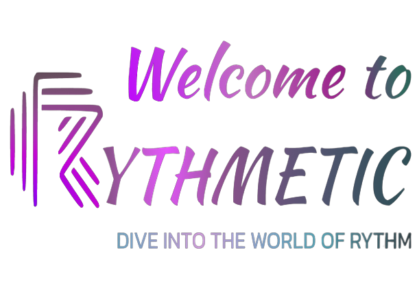

# Rythmetic - Face Recognition Web Application
## Submission for Microsoft Engage 2022 🌟

 
  <a href="https://microsoft-engage-rythmetic.herokuapp.com/">View Deployed Website</a>
    ·
    <a href="">View Demo Video</a>
    ·
    <a href="https://www.figma.com/file/6ms4jHHEhMiatrPmth9TBP/Untitled?node-id=0%3A1">View Design Document</a>

## Features and Interfaces

## Tech stack

	
	
	
	
	
	
  

- Node.js
- Express
- MongoDB
- Handlebars
- Bootstrap
- HTML5
- CSS3
- JavaScript
- Git
- Heroku
- Figma

## Points to remember while testing the app

1. Allow **permissions** for camera and mic
2. In case any **user is not broadcasted** it is probably due to server overload, **REFRESH** the window to solve this. 
3. Make sure the **URL** is starting with https
4. During face recognition, remember that the confidence score of the api is low therefore similar faces may be considered same.

## Getting Started
1. `git clone https://github.com/Apurva-tech/unite.git` 
2. `cd ./unite`
3. Install node dependencies 
   - `npm install`
4. Replace firebase API keys with your configurations
5. Create a `.env` file 
   - Add relevant credentials
   - `cp .env.example .env` 
5. `npm run dev`
6. The app is now running at http://localhost:3030/landing 
